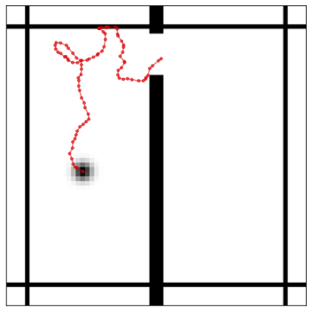
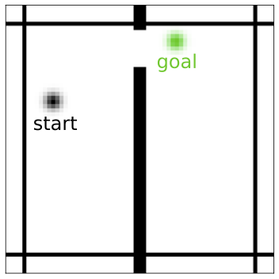

# Two-Rooms Environment

In this environment, there are two rooms separated by a wall with a door, and a point-mass agent is presented with a top down view of the rooms (as well as itself) to perform goal-based navigation. Used as a benchmark in [PLDM](https://latent-planning.github.io/static/paper.pdf).

## Training Data
Trajectories are generated by placing the agent in a random location, and execute a seqeunce of actions for T steps. The actions are generated by first picking a random direction, then using Von Mises distribution centered at the current direction to sample the next action direction. The step size is sampled according to an uniform distribution.

## Test time navigation
At test time, the agent is tasked to navigate from a random start position to a random goal position. In the default setting, start and goal are in different rooms.

## Example
`python example.py`
