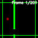
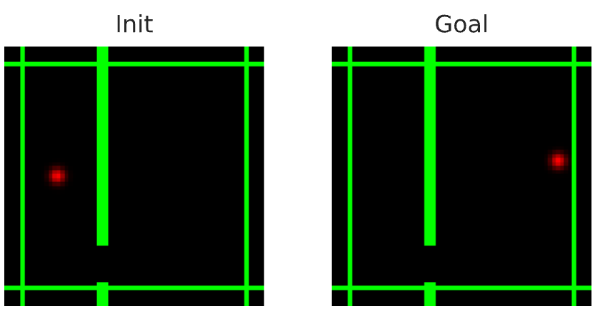
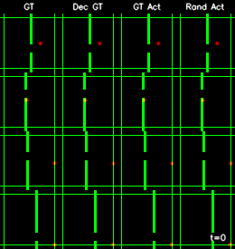
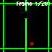
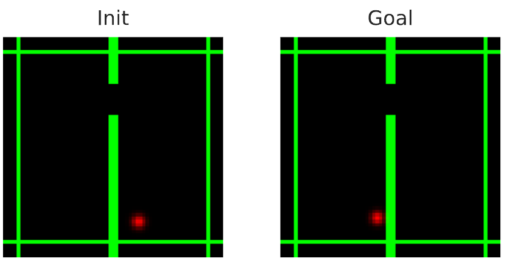
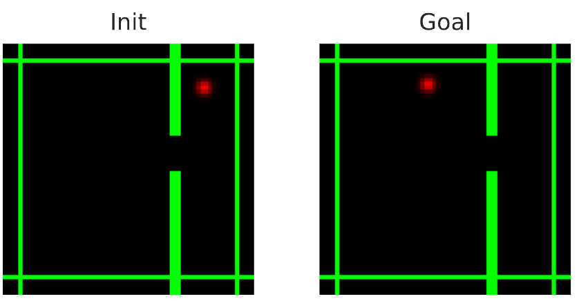
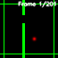
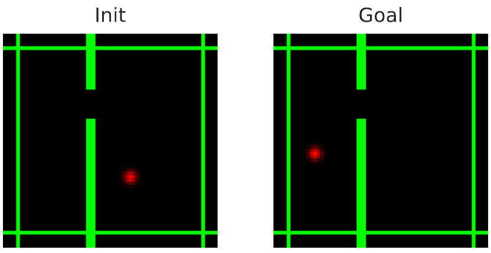
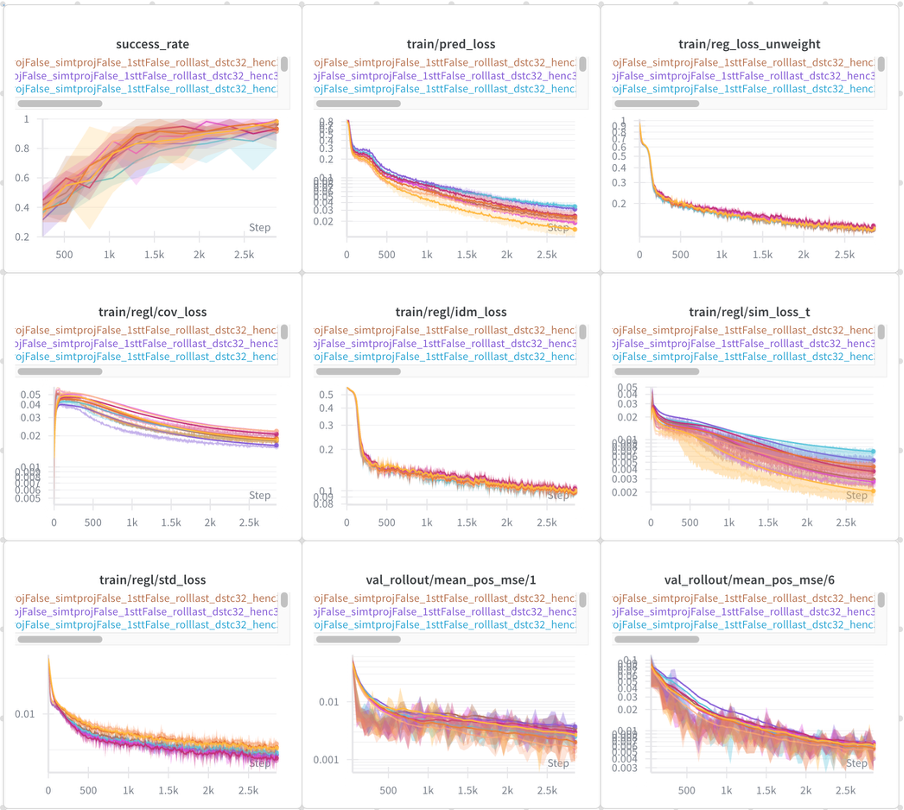

# Example - Action Conditioned Video JEPA

This example demonstrates a Joint Embedding Predictive Architecture (JEPA) for action-conditioned world modeling in the Two Rooms environment. The model learns to predict future states based on current observations and actions, enabling planning towards goal visual embeddings.

| Planning Episode | Task Definition |
|------------------|-----------------|
|  |  |
| *Successful planning episode* | *Episode task definition: from init to goal state* |

## Overview
Action Conditioned Video JEPA extends the `examples/video_jepa` example by incorporating actions into the representation learning and physical dynamics learning process. The image sequence is not fully deterministic, contrary to the video JEPA example. The model requires the action to be able to perfectly predict the next state.

## Training
`TODO:`
- figure of architecture (Amir)


### Architecture
1. **Encoder**: Maps observations to latent representations. Options:
     - *Impala*: The encoder we use to report our final results. Outputs one global representation vector per image.

2. **Predictor**: Predicts future representations based on current state and action. Options:
      - *RNNPredictor*: 2-layer Gated Recurrent Unit for temporal predictions. Used with Impala encoder.

3. **Action Encoder**: Processes action vectors
   - *Identity*: when using the Impala encoder, which yields one vector per image, we just input the 2D action to the associated RNN predictor.

4. **Regularizer**: Prevents representation collapse.
   - *Optional regularization projector*: we use various losses to maintain informative representations. These can involve a projector before computing the regularization loss terms.

### Training Objectives
We train the model with the below loss terms. The first term drives the system to perform the task of interest, namely to predict future states given previous states and action.
- **Prediction Loss**: Minimizes error between predicted and actual future visual embeddings.

But to avoid collapse, we require the below **regularization loss** terms:
- **VC (Variance-Covariance) Loss** from ([Bardes et al. 2021]((https://arxiv.org/abs/2105.04906))): Regularizes representations with two components:
  - *Covariance Loss*: Encourages independence between feature dimensions
  - *Variance Loss*: Ensures feature magnitudes are sufficiently diverse across the batch
- **Time Similarity (time-sim) Loss**: Temporal consistency across frames, smooth the representation landscape following a trajectory of the agent.
- **Inverse Dynamics Model (IDM) Loss**: Used to avoid collapse due to spurious correlation ([Sobal et al. 2022]((https://arxiv.org/abs/2211.10831))) when training with random wall location, introduced for RL in ([Pathak et al. 2017]((https://arxiv.org/pdf/1705.05363))).
The total loss is denoted
$$
L = L_{pred} + \beta L_{cov} + \alpha L_{var} + \delta L_{time-sim} + \omega L_{IDM}.
$$
Given target and predicted visual embeddings $Z, \hat{Z}^k \in \mathbb{R}^{H \times N \times D}$, where $H \leq T$ is the prediction horizon of the model, $N$ is the batch dimension, and $D$ the feature dimension, the prediction loss is
$$
\mathcal{L}_{\mathrm{sim}}= \sum_{k=1}^K \sum_{t=0}^H \frac{1}{N}\sum_{b=0}^N\|\hat{Z}^k_{t,b} - Z_{t,b} \|^2_2.
$$
Regularization losses are defined as follows
$$
\mathcal{L}_{\mathrm{var}} = \frac{1}{HD} \sum^H_{t=0} \sum^D_{j=0} \mathrm{max}(0, \gamma - \sqrt{\mathrm{Var}(Z_{t,:,j}) + \epsilon} ), \\
C(Z_t) = \frac{1}{N-1}(Z_t-\bar{Z_t})^\top(Z_t-\bar{Z_t}),  \ \bar{Z} =  \frac{1}{N} \sum^N_{b=1} Z_{t,b}, \\
\mathcal{L}_{\mathrm{cov}} = \frac{1}{H} \sum^{H}_{t=0} \frac{1}{D} \sum_{i \neq j} [C(Z_t)]^2_{i,j}, \\
\mathcal{L}_{\mathrm{IDM}} = \sum^H_{t=0} \frac{1}{N} \sum^N_{b=0} \| a_{t,b} - \mathrm{MLP}(Z_{(t,b)}, Z_{(t+1,b)}) \|^2_2, \\
\mathcal{L}_{\mathrm{time-sim}}= \sum_{t=0}^{H-1} \frac{1}{N}\sum_{b=0}^N\|Z_{t,b} - Z_{t+1,b} \|^2_2,
$$


### Training Data

We use the controlled data generation procedure of [PLDM](https://arxiv.org/abs/2502.14819).
A ball is moving in a very simple 2D environment with a wall separating two "rooms" and a hole in this wall, the "door" allows to go from one to the other.
At each iteration, a batch of trajectories is generated on the fly.
We can control several parameters of the data generation,
We visualize such trajectories in the GT column of the below unrolling eval results.

We study two setups:
1. **Fixed wall**: we train on a dataset of agent trajectories where the position of the wall and the door is fixed.
2. **Random wall**: we train on a dataset where, for each trajectory of the batch, the wall and door position is randomly sampled &rarr; This is the most challenging and is our final setup.

### Usage
```bash
# Train a model
python -m examples.ac_video_jepa.main \
  --fname examples/ac_video_jepa/cfgs/<train_cfg>.yaml

# Launch sbatch single training
python -m examples.ac_video_jepa.launch_sbatch \
  --fname examples/ac_video_jepa/cfgs/<train_cfg>.yaml \

# Run planning evaluation of specific checkpoint
python -m examples.ac_video_jepa.main \
  --fname examples/ac_video_jepa/cfgs/<train_cfg>.yaml \
  --meta.model_folder /path/to/trained/model \
  --meta.plan_eval_only_mode True

# Run train hyperparameter sweep
python -m examples.ac_video_jepa.launch_sbatch \
  --sweep /sweep/common/folder \
  --fname examples/ac_video_jepa/cfgs/<train_cfg>.yaml \
  --use_wandb_sweep

# Analyse results of training sweep
python -m examples.ac_video_jepa.train_sweep \
  --sweep-folder /sweep/common/folder \
  --enc-type impala \
  --average-over-seeds
```

## Evaluation

### Unrolling evaluation
In this evaluation, we sample a trajectory of the dataset, then:
- **Unrolling**: We encode the first image of the sequence and autoregressively unroll the predictor, conditioned on the actions of this trajectory, feeding back visual embedding predictions to the predictor
- **Decoding**: We feed each visual embedding ouputted by this unrolling to our position probing head, and render it as an image sequence (using the simulator). This is the 'GT Act' column below.

### Planning evaluation
In this evaluation, we perform goal-conditioned trajectory optimization. We optimize over the action space to minimize the below cost (where the $\hat{z}$ sequence is defined recursively):
$$
C(a, s_0, s_g) = \sum_{t=0}^H \| E_{\theta}(s_g) - P_{\theta}(\hat{z}_t, a_t) \|_2, \\
\hat{z}_0 = E_{\theta}(s_0), \quad \hat{z}_{t+1} = P_{\theta}(\hat{z}_t, a_t), \quad t=0,\dots, H.
$$

We define an **evaluation episode** as a pair $(s_0, s_g)$, the *task definition* along with the *plan* outputted by our agent and planning procedure, and whether this leads to $s_g$ (Success) or not (Failure).
We display the success rate as an average over $N$ episodes, with $N=20$.

#### Task definition
We focus on two evaluation setups, defined by how we sample the door and wall position common to $s_0$ and $s_g$, across the $N$ evaluation episodes.
1. **Fixed wall**: The wall and door position is fixed across evaluation episodes.
2. **Random wall**: The wall and door position is randomly sampled for each evaluation episode, with the same procedure as for the training set.

In both setups, we *sample the dot initial and goal position* as follows:
1. Choose which room is for the initial, which is for the goal state.
2. For both the initial and goal position, sample uniformly the y coordinate between the lower and upper wall, sample uniformly the x coordinate between the left and right wall of each room.

#### Planning optimizers
We use either of the below population-based optimizers to find $a$ that minimizes $C(a, s_0, s_g)$. These optimizers both use a Gaussian proposal distribution for the actions of which they iteratively refine the mean and variance parameters $\mu$ and $\sigma$.
- **Model Predictive Path Integral (MPPI)**: Sample-based stochastic optimization that works as follows:
  1. Initialize a Gaussian proposal distribution with mean $\mu_0$ and standard deviation $\sigma_0$
  2. For $j=1,\dots,J$:
     - Sample $N$ action trajectories from the distribution $\mathcal{N}(\mu_j, (\sigma_j)^2 \textbf{I})$
     - Compute costs $c_i, i =1, \dots, K$ for each trajectory using the world model and the formula $C(a, s_0, s_g)$
     - For the top $K$ elite trajectories with lowest costs, calculate importance weights using softmax with temperature $\tau$ for the:
       $$ w_i = \frac{\exp(\frac{c_{min} - c_i}{\tau})}{\sum_{j=1}^{K}\exp(\frac{c_{min} - c_j}{\tau})} $$
     - Update mean and standard deviation using weighted averaging:
       $$ \mu_{j} = \frac{\sum_{i=1}^{K}w_i a_i}{\sum_{i=1}^{k}w_i} $$
       $$ \sigma_{j} = \sqrt{\frac{\sum_{i=1}^{K}w_i(a_i - \mu_{j})^2}{\sum_{i=1}^{K}w_i}} $$
  3. Return the final action trajectory by sampling among the $K$ elite trajectories with probabilities $w_i, i=1, \dots, K$.
- **Cross-Entropy Method (CEM)**: Same algorithm as MPPI but:
  1. Importance weights are $w_i =\frac{1}{K}$ for the $K$ elite trajectories
  2. We return the final refined mean $\mu_J$ as the planned action trajectory

## Results
We consider the fixed wall training setup to be solved as we get 98% success when evaluating on the same wall setup. Hence, we focus on the results on the Random Wall, and **only display results on the Random Wall task in the below sections**.

Our **best model** is trained with the **Impala-RNN** architecture on Random Wall, without projectors before applying the regularization losses, and with the following losses coefficients $(\beta, \alpha, \delta, \omega) = (8, 16, 12, 1)$. The other training hyperparameters are specified in `examples/ac_video_jepa/cfgs/train.yaml` and the planning hyperparameters are in `eb_jepa/planning_mppi.yaml`.
### Unrolling
The unrolling of 90 actions by our best model is illustrated in the below figure. We display a batch of four trajectories. For each  trajectory, we have four columns:
1. **GT**: The first column is the trajectory sampled from the dataset.
2. **Dec GT**: The second column is the decoding of the agent position from the groundtruth visual embeddings of this trajectory.
3. **GT Act**: The most important column is the third one, which is the decoding of the embeddings resulting from the unrolling of the predictor on these 90 actions.
4. **Rand Act**: As a sanity check, we unroll the predictor on random gaussian noise actions and decode them, yielding the fourth column.

| Random Wall |
|-------------|
|  |
| *Random wall train and eval* |

### Planning
In all the below tables, we first obtain success rates as an average over $N=20$ planning episodes. For each model, we launch 3 training seeds, oveer which we average success rate. To account for variability across a single run, we also average the success rate of the last 3 training epochs. We display the **std over 3 seeds and the 3 last epoch checkpoints** for all below sections. This is automatically performed in `examples/ac_video_jepa/train_sweep.py`.

Our best model gets 97% Success in the Random Wall setup.

| Model Architecture | Planner | SR (%) |
|-------------------|---------|------------------|
| Impala - RNN| MPPI   | $97 \pm 2 $ |

#### Visualisation
The below figure shows a successful planning episode with the MPPI planner, a model trained on the fix wall and evaluated on the same wall position.

| Planning Episode | Task Definition |
|------------------|-----------------|
|  |  |
| *Successful planning episode* | *Episode task definition* |

The below figure shows two successful planning episodes with the MPPI planner, and our best model trained and evaluated on random wall.

| Planning Episode | Task Definition |
|------------------|-----------------|
|  |  |
|  |  |
| *Successful planning episode* | *Episode task definition* |
## Ablations

### Training Objectives
We ablate the regularization loss terms, setting to zero each of these 4 loss terms coefficient. We use the MPPI Planner.

| Ablated loss term | SR (%) |
|-------------------|------------------|
| - | $ 97 \pm 2 $ |
| var coeff ($\alpha$) | $ 47 \pm 3 $ |
| cov coeff ($\beta$) | $ 46 \pm 3 $ |
| time sim coeff ($\delta$) | $ 61 \pm 2 $ |
| IDM coeff ($\omega$) | $ 1 \pm 1 $ |

Key insights:
1. As expected, models with $\omega=0$ collapse, due to the spurious correlation caveat mentioned in ([Sobal et al. 2022]((https://arxiv.org/abs/2211.10831))).
2. Removing the time similarity loss harms less performance than removing the variance and covariance loss terms. Yet, the time similarity term, which is motivated by the need to smoothen the embedding space long training trajectories, has a significant effect of about 35% Success Rate.


### Planning optimizer
In the below table, we also compare planning optimizers in terms of success rate and planning time, with the same hyperparameters, specified in `eb_jepa/planning_mppi.yaml` and `eb_jepa/planning_cem.yaml`, and our best Impala model, specified in `examples/ac_video_jepa/cfgs/train.yaml`.

| Model Architecture | Planner | SR (%) | Episode time (s) |
|-------------------|---------------|------------------|----|
| Impala - RNN      | MPPI    |   $ 97 \pm 2 $   | 37   |
| Impala - RNN      | CEM     |   $ 96 \pm 2 $   | 37  |
| Impala - RNN      | MPPI - last     |   $ 89 \pm 2 $   | 37  |

Key insights:
1. Defining the planning cost as in the above section, as a sum of the distances of the "imagined" embeddings to the goal embedding, brings a clear improvement (about 8% SR) compared to only using the distance of the last imagined embedding, which we denote as **"MPPI last"** in the above table. Summing over the intermediate states pushes the agent to reach the goal in as few actions as possible and yields a planning cost more robust to prediction compounding errors.
2. The MPPI method gives slightly higher performance than CEM as it is more explorative, avoiding getting stuck in local planning cost minima. This is due to selecting the action to step by sampling with probability the value associated to the top-k trajectories.


## Experiment tracking
We encourage to use the extensive integration of wandb logging in this `ac_video_jepa` example.
To reproduce the below plot, launch a training sweep with the below values for the regularization loss coefficients, hardcoding them in `examples/ac_video_jepa/launch_sbatch.py` and launching
```
python -m examples.ac_video_jepa.launch_sbatch \
  --sweep /sweep/common/folder \
  --fname examples/ac_video_jepa/cfgs/train.yaml \
  --use_wandb_sweep
```

| $\beta$ | $\alpha$ | $\delta$ | $\omega$ |
|---------|---------|---------|--------|
|  [8, 12] | [8, 16]  | [8, 12, 16] | [1, 2] |

| Loss coeff train sweep |
|------------------|
|  |
| *Wandb logging of success rate, losses and unroll eval metrics throughout a training sweep of regularization loss coefficients, on the random wall setup. Each curve is the average of 3 runs with different training seeds.* |

## References
- [JEPA Paper](https://openreview.net/pdf?id=BZ5a1r-kVsf)
- [PLDM and Two-Rooms Environment](https://arxiv.org/abs/2502.14819)
- [MPPI](https://arxiv.org/abs/1509.01149)
- [CEM](https://asco.lcsr.jhu.edu/papers/Ko2012.pdf)
- [ResNet Architecture](https://arxiv.org/abs/1512.03385)
- [Impala encoder](https://proceedings.mlr.press/v80/espeholt18a)
- [VICReg](https://arxiv.org/abs/2105.04906)
- [JEPA Slow Features](https://arxiv.org/abs/2211.10831)
