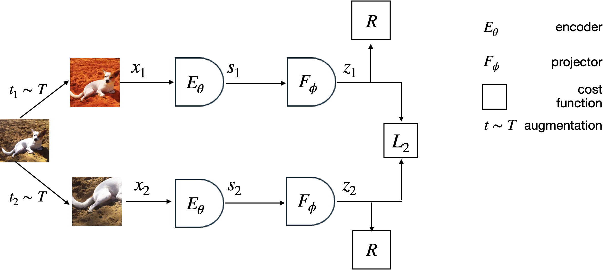
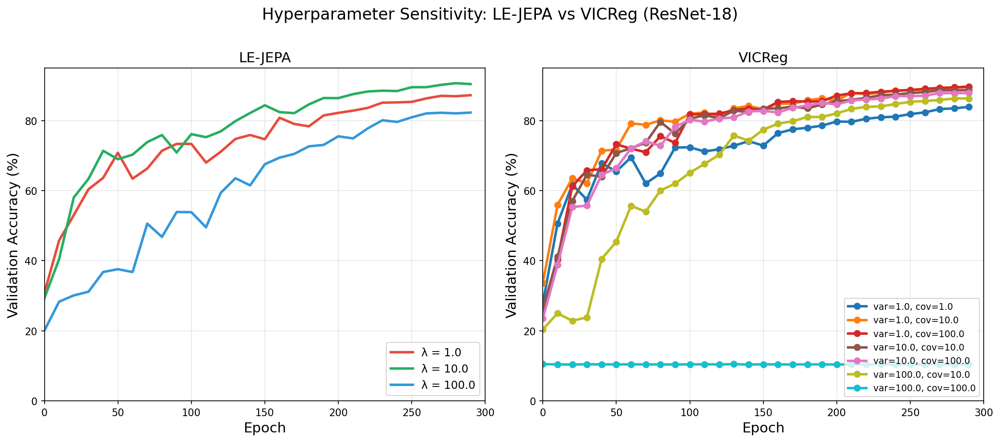

## Self-Supervised Representation Learning from Unlabeled Images

This example demonstrates how to train a Joint Embedding Predictive Architecture (JEPA) on unlabeled images. The model learns representations from individual frames of the CIFAR 10 dataset and is evaluated using linear probing for image classification.



## Features

- **Image-only training**: Training from unlabeled image data
- **Representation learning**: Learns meaningful representations through self-supervised learning, avoids collapse using Variance-Covariance or LeJEPA (SIGReg) Regularization.
- **Linear probing evaluation**: Evaluates learned representations using a linear classifier


## Architecture

The Image JEPA consists of:
- **Encoder**: ResNet5 backbone that processes individual images
- **Regularizer**: Variance-Covariance (VC) loss to prevent representation collapse
- **Predictor**: Simple reconstruction task for individual images
- **Linear Probe**: Frozen encoder + linear classifier for evaluation

## Usage

### Training Configurations

#### 1. ResNet + VICReg Loss

```bash
python main.py \
    --model_type resnet \
    --loss_type vicreg \
    --var_loss_weight 1.0 \
    --cov_loss_weight 80.0 \
    --batch_size 256 \
    --epochs 300
```

#### 2. ResNet + LE-JEPA (SIGReg) Loss

```bash
python main.py \
    --model_type resnet \
    --loss_type bcs \
    --lmbd 10.0 \
    --batch_size 256 \
    --epochs 300
```

#### 3. Vision Transformer + VICReg Loss

```bash
python main.py \
    --model_type vit_s \
    --patch_size 2 \
    --loss_type vicreg \
    --sim_loss_weight 25.0 \
    --var_loss_weight 25.0 \
    --cov_loss_weight 1.0 \
    --batch_size 256 \
    --epochs 300
```

For ViT-Base, use `--model_type vit_b` instead of `vit_s`.

## Results

Results on CIFAR-10 with ResNet-18 backbone, trained for 300 epochs.

### LE-JEPA (SigREG Loss) Best Configuration

| Parameter | Value |
|-----------|-------|
| **Best Accuracy** | **90.67%** |
| batch_size | 256 |
| lmbd (λ) | 10.0 |
| use_projector | Yes |
| proj_hidden_dim | 2048 |
| proj_output_dim | 128 |

### Impact of Lambda (λ)


| λ | Best Acc |
|---|----------|
| 1.0 | 87.23% |
| **10.0** | **90.67%** |
| 100.0 | 82.28% |

**Finding:** λ=10.0 is optimal. Too low (λ=1) underperforms by ~3.4%, too high (λ=100) underperforms by ~8.4%.

### Impact of Projector

| Configuration | Mean | Max |
|---------------|------|-----|
| **With Projector** | **90.29%** | **90.67%** |
| No Projector | 87.69% | 88.15% |

**Finding:** Using a projector provides **+2.5%** improvement.

### Projector Dimensions (proj_hidden_dim × proj_output_dim)

Top 5 dimension combinations (with λ=10.0, batch_size=256):

| Rank | Dimensions | Accuracy |
|------|------------|----------|
| 1 | 2048 × 128 | 90.67% |
| 2 | 1024 × 256 | 90.65% |
| 3 | 512 × 1024 | 90.61% |
| 4 | 512 × 256 | 90.60% |
| 5 | 4096 × 4096 | 90.56% |

**Finding:** Larger hidden dimensions (1024-2048) with smaller output dimensions (128-256) work best. The bottleneck effect (compressing representations) appears beneficial.

---

### Comparison: LE-JEPA vs VICReg



| Metric | LE-JEPA (SigReg) | VICReg |
|--------|------------------|--------|
| Best Accuracy | 90.67% | 90.95% |
| Projector Benefit | +2.5% | Variable |
| Stability | High | Lower (sensitive to hyperparams) |
| Best Projector Dims | 2048×128 | 2048x2048 |

**Conclusion:** Both methods achieve similar peak performance (~90%). LE-JEPA is more stable across hyperparameter choices, while VICReg can match performance but requires more careful tuning.

## References
- [JEPA Paper](https://openreview.net/pdf?id=BZ5a1r-kVsf)
- [ResNet Architecture](https://arxiv.org/abs/1512.03385)
- [Transformer Architecture](https://arxiv.org/abs/1706.03762)
- [Vision Transformer Architecture](https://arxiv.org/abs/2010.11929)
- [VICReg](https://arxiv.org/abs/2105.04906)
- [LeJEPA](https://arxiv.org/abs/2511.08544)