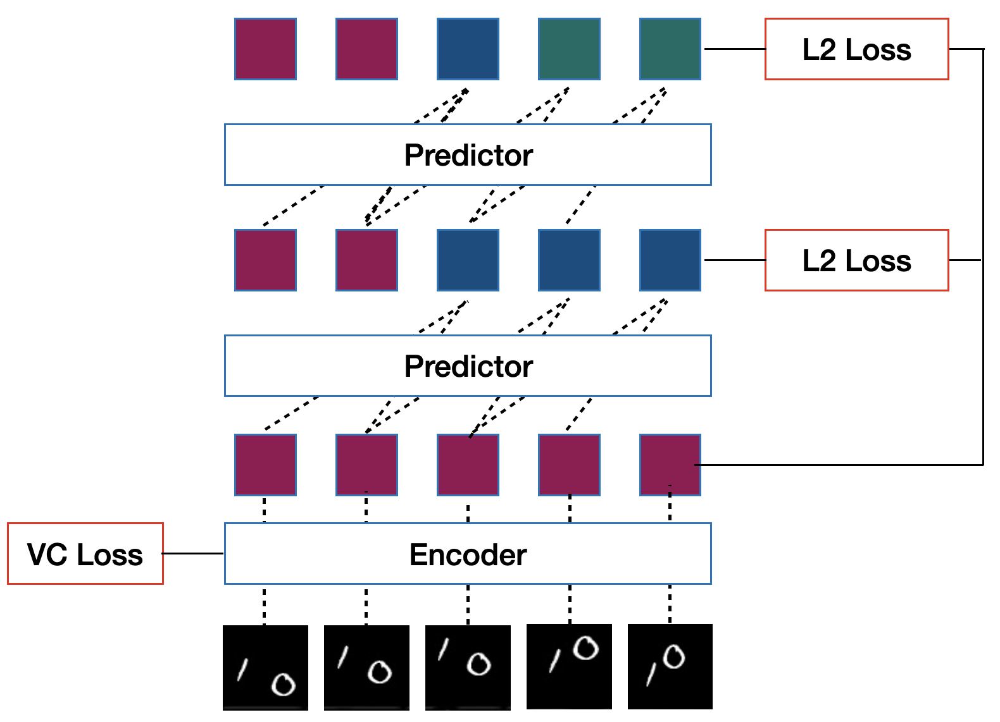
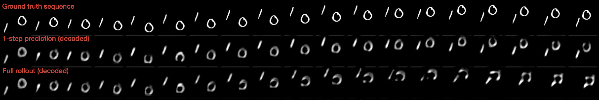
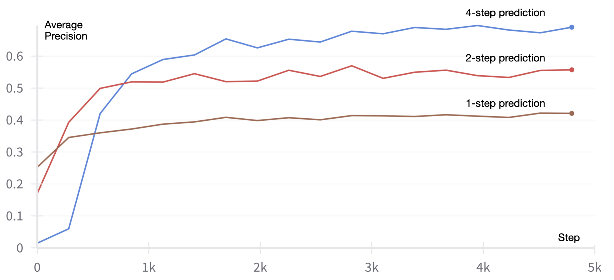

# JEPA For Learning from a Video Sequence

This example demonstrates Joint Embedding Predictive Architecture (JEPA) for self-supervised representation learning on video sequences. The model learns to predict future video representations from past observations without requiring labeled data.

## Overview

JEPA learns representations by training an encoder to map observations to a latent space and a predictor to predict future representations. The key insight is that good representations should enable better prediction of future states.





## Architecture

### Components


1. **Encoder (`ResNet5`)**: A lightweight ResNet that maps video frames to latent representations
   - Input: Video frames `(B, C, T, H, W)`
   - Output: Latent representations `(B, dstc, T, H, W)`
   - Uses residual blocks for stable gradient flow

2. **Predictor (`ResUNet`)**: A UNet-based architecture that predicts future representations
   - Input: Concatenated current and previous representations
   - Output: Predicted future representations
   - Skip connections preserve spatial information

3. **Projector**: MLP that projects representations before applying a cost function
   - Enables comparing projecctions instead of encoder representations

### Training Objectives

- **Prediction Loss**: - Minimizes prediction error between predicted and actual future representations
- **VC Loss (Variance-Covariance)**: Regularizes representations to prevent collapse

## Self-Supervised Learning Approach

The model learns representations through:

1. **Temporal Prediction**: Given current and previous representations, predict the next representation
2. **Multi-step Rollout**: Extend predictions to multiple future time steps
3. **Collapse Prevention**: Ensure representations do not collapse using Variance-Covariance Loss.

This approach forces the encoder to learn features that capture:
- Object motion and dynamics
- Spatial relationships
- Temporal consistency

### How the Predictor Achieves Coherent Temporal Dynamics

The predictor maintains coherent temporal dynamics through several key mechanisms:

1. **Context-Aware Input**: The predictor receives concatenated representations from the current and previous time steps `[z_t, z_{t-1}]`, providing temporal context about recent motion and state changes.

2. **ResUNet Architecture**: The UNet structure with skip connections preserves spatial information while the residual blocks maintain gradient flow, allowing the model to learn both local and global temporal patterns.

3. **Autoregressive Rollout**: During inference, the predictor operates in an autoregressive manner:
   - Predicts the next representation: `z_{t+1} = f(z_t, z_{t-1})`
   - Uses this prediction as input for the next step: `z_{t+2} = f(z_{t+1}, z_t)`
   - This creates a chain of predictions that maintain temporal consistency

4. **Representation Regularization**: The VC loss ensures representations don't collapse to trivial values, maintaining the rich temporal information needed for coherent predictions.

5. **Motion Understanding**: By training on sequences with consistent physics (bouncing digits), the model learns to encode motion vectors and trajectory information that naturally extend into the future.

This combination allows the predictor to generate temporally coherent sequences that respect the underlying dynamics of the moving objects, even when extending predictions multiple steps into the future.

## Usage

```bash
python main.py \
    --batch_size 64 \
    --dobs 1 \
    --henc 32 \
    --hpre 32 \
    --dstc 16 \
    --steps 1 \
    --cov_coeff 10.0 \
    --std_coeff 200.0 \
    --epochs 100 \
    --lr 5e-4
```

### Key Parameters

- `dobs`: Input observation dimensions
- `henc`: Hidden dimensions in encoder
- `hpre`: Hidden dimensions in predictor
- `dstc`: Output representation dimensions
- `steps`: Number of prediction steps during training
- `cov_coeff`: Variance-covariance loss coefficient
- `std_coeff`: Standard deviation loss coefficient

## Dataset

The example uses Moving MNIST, a synthetic dataset where:
- Multiple digits move across the screen
- Motion follows simple physics (bouncing off boundaries)
- Each video has a fixed number of frames
- Ground truth digit locations are available for evaluation

## Evaluation

The model is evaluated on:
- **Reconstruction Loss**: How well the decoder can reconstruct input from representations
- **Detection Loss**: Performance on digit location prediction task
- **Average Precision (AP)**: Quality of multi-step predictions

## Visualization

### Results

*Visualization showing input frames, 1-step predictions visaulization, and full rollout, obtained via auto-regressive prediction, on Moving MNIST data.* 



### Multi-step Prediction Analysis

#### K-Step Predictions

*Analysis showing that recursively predicting more steps achieve significantly better Average Precision (AP) compared to 1-step predictions. This decreases exposure bias, the discrapancy between train and test, and demonstrates the model's improved temporal understanding with longer prediction horizons.*




## Key Insights

1. **Representation Quality**: Good representations enable accurate multi-step prediction
2. **Temporal Consistency**: The model learns to maintain consistency across time steps
3. **Motion Understanding**: Representations capture object dynamics and trajectories
4. **Generalization**: Learned features transfer to downstream tasks like detection

## References

- [JEPA Paper](https://openreview.net/pdf?id=BZ5a1r-kVsf)
- [Moving MNIST Dataset](https://github.com/edenton/svg)
- [ResNet Architecture](https://arxiv.org/abs/1512.03385)
- [UNet Architecture](https://arxiv.org/abs/1505.04597)
- [VC Loss](https://arxiv.org/abs/2105.04906)

